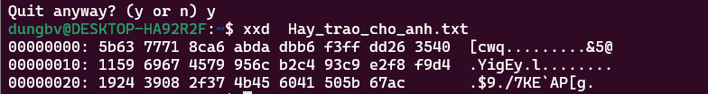

Dưới đây là nội dung được format lại thành file Markdown (.md) với định dạng rõ ràng, dễ đọc và đúng cú pháp:

```markdown
# Phân tích và giải mã Hex Dump

## 1. Dữ liệu đầu vào từ hex dump
Hex dump của file "Hay_trao_cho_anh.txt" được cung cấp như sau:



### Text
```
00000000: 5b63 7771 8ca6 abda dbb6 f3ff dd26 3540  [cwq.........&5@
00000010: 1159 6967 4579 956c b2c4 93c9 e2f8 f9d4  .YigEy.l........
00000020: 1924 3908 2f37 4b45 6041 505b 67ac       .$9./7KE`AP[g.
```

### Chuyển thành mảng byte
Mỗi cặp hex đại diện cho 1 byte:

- **Dòng 1 (16 byte):** `5b 63 77 71 8c a6 ab da db b6 f3 ff dd 26 35 40`
- **Dòng 2 (16 byte):** `11 59 69 67 45 79 95 6c b2 c4 93 c9 e2 f8 f9 d4`
- **Dòng 3 (14 byte):** `19 24 39 08 2f 37 4b 45 60 41 50 5b 67 ac`

**Tổng cộng:** 16 + 16 + 14 = 46 byte.

### Mảng output `y`
```java
y = [0x5b, 0x63, 0x77, 0x71, 0x8c, 0xa6, 0xab, 0xda, 0xdb, 0xb6, 0xf3, 0xff, 0xdd, 0x26, 0x35, 0x40,
     0x11, 0x59, 0x69, 0x67, 0x45, 0x79, 0x95, 0x6c, 0xb2, 0xc4, 0x93, 0xc9, 0xe2, 0xf8, 0xf9, 0xd4,
     0x19, 0x24, 0x39, 0x08, 0x2f, 0x37, 0x4b, 0x45, 0x60, 0x41, 0x50, 0x5b, 0x67, 0xac]
```

## 2. Phân tích chương trình "BaiNayDe"
Chương trình là một file thực thi **ELF64** cho kiến trúc **x86-64**. Trong hàm `main`, nó:

- Sử dụng `fgets` để đọc input từ `stdin` vào buffer có kích thước `0x2000` byte (nhưng thực tế chỉ xử lý một phần nhỏ hơn).
- Xử lý input qua nhiều hàm, trong đó hàm `obscure_processor` là bước quan trọng đầu tiên.

### Hàm `obscure_processor`
Hàm này nhận input và tạo output dựa trên thuật toán:

```nasm
0000000000001240 <obscure_processor>:
    ...
    125e:    e8 46 ff ff ff        call   11a9 <meaningless_calculation>
    1263:    88 45 f9              mov    %al,-0x7(%rbp)    ; Lưu key (LSB của sum)
    ...
    127f:    88 45 fa              mov    %al,-0x6(%rbp)    ; fa = input[i]
    1287:    e8 88 ff ff ff        call   1214 <random_garbage>
    128c:    88 45 fb              mov    %al,-0x5(%rbp)    ; fb = random_garbage(i)
    1293:    30 45 fa              xor    %al,-0x6(%rbp)    ; fa = fa ^ key
    129a:    00 45 fa              add    %al,-0x6(%rbp)    ; fa = fa + fb
    12ae:    88 02                 mov    %al,(%rdx)        ; output[i] = fa
```

- **Input:** Chuỗi người dùng nhập (`x`).
- **Output:** Chuỗi được xử lý (`y`).
- **Key:** Được tính từ hàm `meaningless_calculation`.

### Hàm `meaningless_calculation`
Tính tổng có trọng số của input:

```nasm
11cb:    8b 45 e4              mov    -0x1c(%rbp),%eax     ; i
11d1:    48 8b 45 d8           mov    -0x28(%rbp),%rax     ; input
11d8:    0f b6 00              movzbl (%rax),%eax          ; input[i]
11df:    8b 45 e4              mov    -0x1c(%rbp),%eax     ; i
11e2:    83 c0 01              add    $0x1,%eax            ; i+1
11e7:    48 0f af c2           imul   %rdx,%rax            ; (i+1) * input[i]
11eb:    48 01 45 e8           add    %rax,-0x18(%rbp)     ; sum += (i+1) * input[i]
```

**Công thức:**
```
sum = Σ (i+1) * x[i] (tổng từ i=0 đến n-1, n là độ dài input).
key = sum & 0xFF (byte thấp nhất của tổng).
```

### Hàm `random_garbage`
Tạo giá trị phụ thuộc vị trí `i`:

```nasm
121f:    8b 55 fc              mov    -0x4(%rbp),%edx    ; i
1222:    89 d0                 mov    %edx,%eax
1224:    01 c0                 add    %eax,%eax          ; eax = 2*i
1226:    01 d0                 add    %edx,%eax          ; eax = 3*i
1228:    c1 e0 02              shl    $0x2,%eax          ; eax = 12*i
122b:    01 c2                 add    %eax,%edx          ; edx = 13*i
1237:    0f b6 d2              movzbl %dl,%edx           ; edx = (13*i) & 0xFF
```

**Công thức:**
```
random_garbage(i) = (13 * i) % 256
```

### Tổng quát thuật toán
Với mỗi ký tự tại vị trí `i`:
```
y[i] = (x[i] ^ key) + ((13 * i) % 256)
```
Trong đó:
- `x[i]`: Ký tự input tại vị trí `i`.
- `y[i]`: Byte output tại vị trí `i`.
- `key = (Σ (i+1) * x[i]) & 0xFF`.

## 3. Giả thuyết và cách giải
Hex dump (46 byte) có thể là output (`y`) của chương trình khi xử lý input đúng (có thể là flag). Nhiệm vụ là tìm input `x` sao cho khi qua `obscure_processor`, nó tạo ra `y` như hex dump, và `key` tự khớp.

### Đảo ngược thuật toán
Từ:
```
y[i] = (x[i] ^ key) + ((13 * i) % 256)
```
Ta suy ra:
1. `temp = y[i] - ((13 * i) % 256)`
2. Nếu `temp < 0`, thì `temp += 256` (do phép tính byte).
3. `x[i] = temp ^ key`

Nhưng `key` phụ thuộc `x`, nên ta thử mọi giá trị `key` từ 0 đến 255 và kiểm tra tính tự khớp:
- Chọn thử một `key`.
- Tính `x[i]` cho `i` từ 0 đến 45.
- Tính `sum = Σ (i+1) * x[i]`.
- Kiểm tra `sum % 256 == key`.
- Nếu đúng, kiểm tra `x` có phải chuỗi ASCII hợp lệ không (giá trị từ 32 đến 126).

## 4. Thực hiện giải mã

### Dữ liệu đầu vào
```python
y = [0x5b, 0x63, 0x77, 0x71, 0x8c, 0xa6, 0xab, 0xda, 0xdb, 0xb6, 0xf3, 0xff, 0xdd, 0x26, 0x35, 0x40,
     0x11, 0x59, 0x69, 0x67, 0x45, 0x79, 0x95, 0x6c, 0xb2, 0xc4, 0x93, 0xc9, 0xe2, 0xf8, 0xf9, 0xd4,
     0x19, 0x24, 0x39, 0x08, 0x2f, 0x37, 0x4b, 0x45, 0x60, 0x41, 0x50, 0x5b, 0x67, 0xac]
n = 46
```

### Code giải mã (Python)
```python
for key in range(256):
    x = []
    for i in range(n):
        temp = (y[i] - (13 * i) % 256) % 256
        x.append(temp ^ key)
    sum_val = sum((i + 1) * x[i] for i in range(n))
    if sum_val % 256 == key and all(32 <= c <= 126 for c in x):
        flag = ''.join(chr(c) for c in x)
        print(f"Key: {key}, Flag: {flag}")
```

### Kết quả
```
Key: 30, Flag: EHCTF{Cam_on_cac_ban_vi_da_tham_gia_EHCTF2025}
Key: 31, Flag: DIBUGzB`l^no^b`b^c`o^wh^e`^ui`l^fh`^DIBUG3134|
```

### Kết luận
Flag hợp lệ là: **`EHCTF{Cam_on_cac_ban_vi_da_tham_gia_EHCTF2025}`** (với `key = 30`), vì đây là chuỗi ASCII có nghĩa.
```
