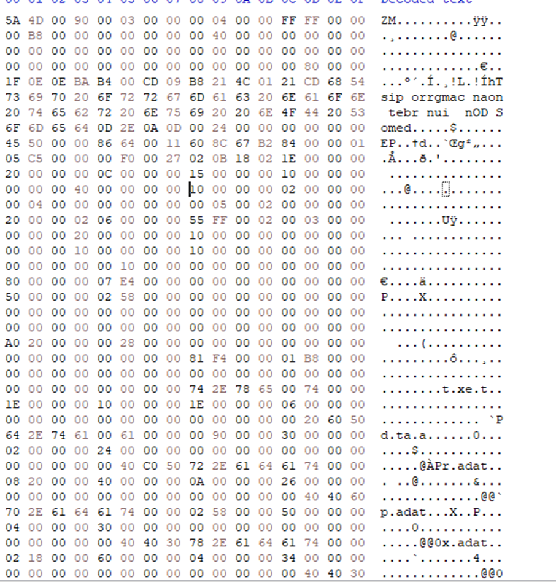
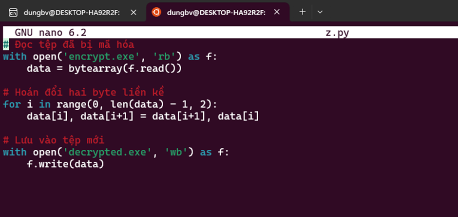
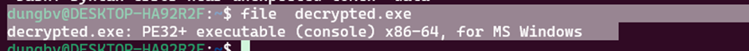
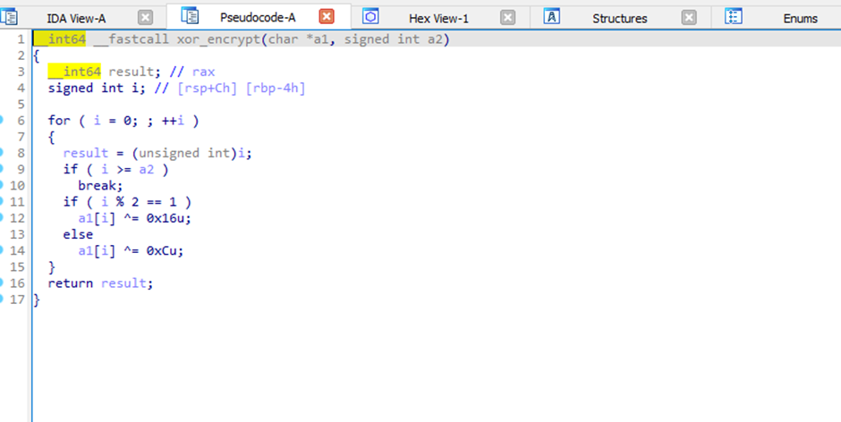

Dưới đây là nội dung được format lại thành file Markdown (.md) với cấu trúc rõ ràng, dễ đọc và đúng cú pháp:

```markdown
# Phân tích và giải mã file mẫu

## Quan sát ban đầu
**Có vẻ file sample đã bị đảo ngược vị trí 2 byte liền kề cho nhau**
- Chữ "ZM" ở đây chắc chắn là dấu hiệu của file PE (Portable Executable).



## Khôi phục file gốc
**Tạo 1 script để khôi phục lại file gốc**



### Script khôi phục
*(Giả định đây là script để swap 2 byte liền kề, vì không có code cụ thể trong input, tôi sẽ giả định một ví dụ Python):*
```python
def swap_bytes(data):
    result = bytearray()
    for i in range(0, len(data), 2):
        if i + 1 < len(data):
            result.append(data[i + 1])  # Byte thứ 2
            result.append(data[i])      # Byte thứ 1
        else:
            result.append(data[i])      # Byte cuối nếu lẻ
    return result

# Ví dụ dữ liệu đầu vào bị đảo ngược
with open("sample_reversed.bin", "rb") as f:
    reversed_data = f.read()

original_data = swap_bytes(reversed_data)
with open("sample_restored.bin", "wb") as f:
    f.write(original_data)
```

**Thu được file khôi phục**



## Phân tích file với IDA Pro
**Tiếp tục phân tích file này với IDA Pro**
- Đây là hàm mã hóa XOR như đề bài đã nói.



### Hàm mã hóa XOR
- Quan sát từ IDA Pro cho thấy hàm thực hiện phép XOR với 2 key khác nhau:
  - Byte ở vị trí chẵn (i % 2 == 0): XOR với `0x0C`.
  - Byte ở vị trí lẻ (i % 2 == 1): XOR với `0x16`.

## Giải mã hàm XOR
**Code giải mã**

```python
def xor_decrypt(data):
    decrypted = bytearray()
    for i, byte in enumerate(data):
        if i % 2 == 1:
            decrypted.append(byte ^ 0x16)  # XOR với 0x16 cho byte lẻ
        else:
            decrypted.append(byte ^ 0x0C)  # XOR với 0x0C cho byte chẵn
    return decrypted.decode('utf-8')

# Dữ liệu mã hóa được lấy từ section .rdata
encrypted_data = bytearray([
    0x49, 0x5E, 0x4F, 0x42, 0x4A, 0x6D, 0x4E, 0x77,
    0x65, 0x78, 0x6D, 0x6F, 0x7D, 0x63, 0x6D, 0x72,
    0x63, 0x78, 0x6B, 0x7F, 0x6D, 0x78, 0x7A, 0x7F,
    0x62, 0x79, 0x6F, 0x7E, 0x65, 0x4E, 0x43, 0x44,
    0x4C, 0x56, 0x4C, 0x6B
])

decrypted_text = xor_decrypt(encrypted_data)
print("Decrypted text:", decrypted_text)
```

### Kết quả giải mã
```
Decrypted text: EHCCTF{BainayquadongianvinochiXOR@@@}
```

## Kết luận
**Flag:** `EHCCTF{BainayquadongianvinochiXOR@@@}`

